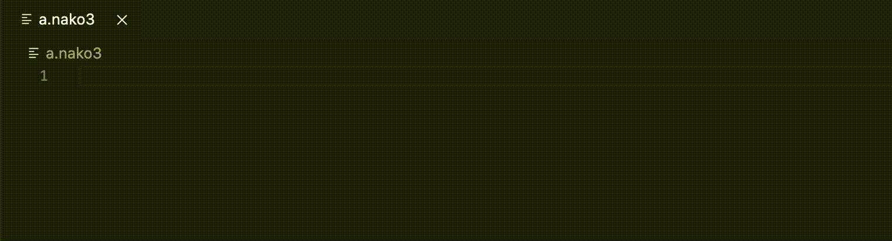

# nadesiko3 vscode extension

This is a Visual Studio Code extension for nadesiko3(なでしこ3)

## Functionality

- Syntax Highlight
- Diagnostics regenerated on each file change or configuration change

## Running the code

- Run `npm install` in this folder. This installs all necessary npm modules in both the client and server folder
- Open VS Code on this folder.
- Press Ctrl+Shift+B to compile the client and server.
- Switch to the Debug viewlet.
- Select `Launch Client` from the drop down.
- Run the launch config.
- If you want to debug the server as well use the launch configuration `Attach to Server`
- In the [Extension Development Host] instance of VSCode, open a document  with ".nako3" extension.
  - Enter text content such as `「こんにちは」を表示`. It will be hilighted. 
  - If the content is invalid, this extension will emit diagnostics.

## demo

